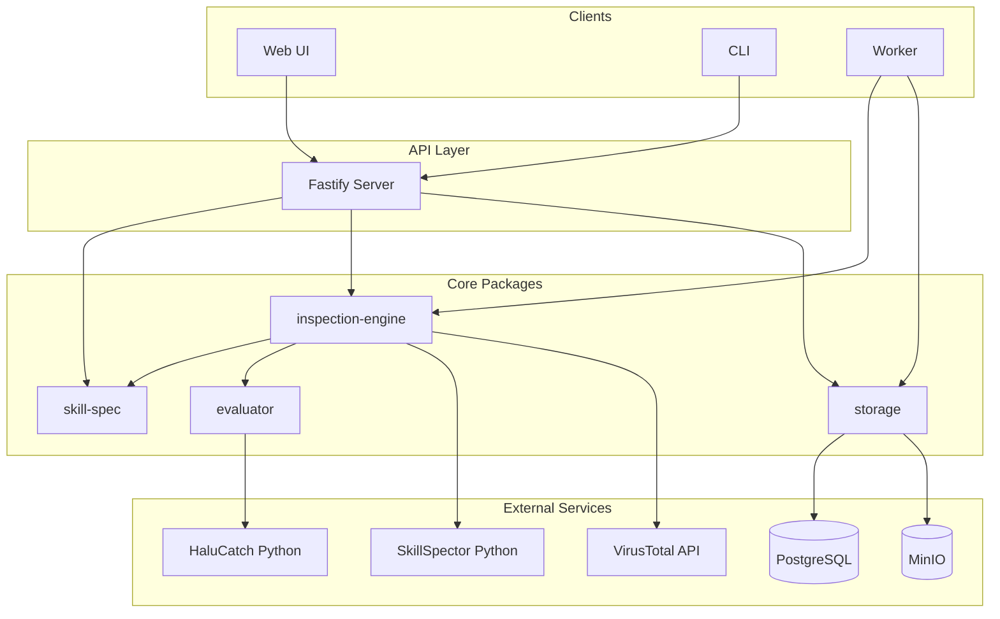

# 架构设计

本文档描述 Skill 管理平台的当前架构，与 `AGENTS.md` 和代码实现保持一致。

## 1. 总体目标

平台用于发布、审查、评估、分发和管理 Agent Skill。核心原则：

- **静态审查优先**：不执行 Skill 内脚本；安全与可靠性依赖静态分析与第三方扫描。
- **slug 为唯一标识**：`slug` 不可变，用于数据库主键、API/CLI 参数、URL 和 MinIO 对象路径；`name` 仅作展示。
- **API 为唯一数据入口（Web / CLI）**：Web 与 CLI 通过 HTTP API 访问数据，不直连 PostgreSQL 或 MinIO。Worker 是例外——它是进程内批处理，直接复用 `packages/storage` 与 `inspection-engine`（路线图计划替换为 Redis/BullMQ 队列消费者）。

## 2. Monorepo 结构

```text
apps/
  api/       Fastify HTTP API（端口 3000）
  cli/       内部 Commander CLI（逐步由 skillnav 取代）
  worker/    批量重审/评估 Worker
  web/       Next.js Web UI（端口 3001）
packages/
  skill-spec/     SKILL.md 解析、校验、快照与 ZIP
  inspection-engine/  静态风险审查与评分
  evaluator/      HaluCatch 五维评估适配（+ tests/*.json 任务集回退）
  storage/        PostgreSQL 注册表 + MinIO artifact
cli-py/      对外 Python CLI skillnav（PyPI 分发）
tests/       vitest 单元/集成测试 + skillnav pytest
scripts/     开发/运维脚本（setup、smoke 编排等）
e2e/         Playwright 端到端测试
docs/
  rules/          Skill 规范与审查规则
examples/
  demo-skill/     本地验证用 Skill
```

所有包使用 ESM、严格 TypeScript；共享包通过 `@skill-platform/*` 路径别名导入。

## 3. 系统架构图




## 4. 数据流


### 4.1 发布流程

```text
用户上传 ZIP / 文件夹
  → skill-spec 读取（Web 发布时可 loose 解析 SKILL.md frontmatter）
  → 合并表单 metadata（name、description、slug 等）到 manifest
  → 生成 SkillSnapshot（contentHash、文件树）
  → inspection-engine 审查 + 评估
  → 可选：完整 artifact ZIP 写入 MinIO
  → storage 写入 PostgreSQL（Skill、Version、Inspection、Evaluation、artifact descriptor）
       MinIO 启用时 skill_version_files 只保存路径、大小和 SHA-256
  → 默认异步：立即返回 202（仅版本与 inspecting 状态，不含 verdict / 评分）
     同步（publish --wait）：流水线结束返回 201 与 verdict；未完成返回 503
```

Web 发布路径会在审查前补全缺失或不完整的 frontmatter，避免因 `description` 等字段缺失而直接拒绝发布。

### 4.2 审查流水线

发布时平台 **先暂存包**，再运行审查（Web / CLI 默认 **异步**，后台执行）。审查顺序（`runInspectionPipeline`）：

```text
1. 格式校验（validateSkillSnapshot）→ compliance findings
2. 并行执行：
   ├── SkillSpector 静态安全扫描（Python，可选）
   └── VirusTotal 静态 AV 扫描（可选，见 §5.3）
        └─ 默认「上传即结束」：上传成功后本阶段返回 processing，
           报告由 5 分钟后台补取（VIRUSTOTAL_WAIT_FOR_ANALYSIS=true 才同步等待）
3. HaluCatch 五维可靠性评估（Python，可选；**仅 HALUCATCH_ENABLED=false 显式禁用时**才回退 tests/*.json——已启用但运行期不可用会记为阶段失败）
4. 汇总 findings → verdict（三项评分 `calculateScores` 当前为占位实现，恒返回 100，不由 findings 计算）
```

**待补取 ≠ 失败**：VirusTotal 报告尚未就绪时该阶段为 `processing`，整体 `inspectionStatus: inspecting`，**仅拥有者 / contributor（及管理员）可见**、不进公开搜索；补齐后自动 finalize 并公开。判定由响应驱动（404 / 统计未齐 → 继续等；401/403/429 或超过 `VIRUSTOTAL_DEFERRED_TIMEOUT_MS`（默认 45 分钟）→ 中断），补取完成后换入 VT findings 并 **重新判定 verdict**。

**审查中断**（任一已启用环节未成功完成）：`inspectionStatus: interrupted`（旧数据里的 `failed` 归一化为它），包通常 **已暂存**；通过 `POST /skills/:slug/retry-publish` 或 CLI `retry-publish` **增量重试**失败/未完成环节。`inspecting` 期间调用 retry 会返回 409 `skill_inspection_in_progress`。

**Verdict 规则**（`calculateInspectionVerdict`，仅 SkillSpector / VirusTotal 触发自动拒绝）：

- **rejected**：SkillSpector 任意 `high` / `critical`；或 SkillSpector `medium` 且置信度 ≥ 90%；或 VirusTotal 任意 `high` / `critical`（如 malicious 类别合并 finding）
- **needs-inspection**：存在其他 finding（含 suspicious VT、平台合规/质量规则等）
- **published**：无任何 finding

**公开发现**：`search()` / 榜单要求最新版本 `inspectionStatus: completed`，因此 verdict 为 `rejected`、以及仍在 `inspecting`（含 VT 待补取）或 `interrupted` 的 Skill 都不在公开结果中；拥有者个人中心通过 `listRejectedSkillsForOwner` 合并展示。

**评分维度**：`qualityScore`、`securityScore`、`reliabilityScore` 三个字段保留以兼容榜单/搜索 API，但 `calculateScores` 是**占位实现**（恒返回 100，不按 finding / SkillSpector / HaluCatch 计算）；用户可见的安全结论取自 SkillSpector 的 `riskScore` 与 finding，不是 `securityScore`。

### 4.3 读取与分发

```text
GET /skills、/skills/:slug → PostgreSQL 元数据；有 MinIO artifact 时从 MinIO 读取文件内容
GET /skills/:slug/download → MinIO artifact 或 PostgreSQL 文件内容重建 ZIP
Worker（`store.inspectAll`）→ 对注册表 Skill 重跑审查（进程内，不走 HTTP）
```


## 5. 核心模块


### 5.1 skill-spec


| 职责          | 说明                                                        |
| ----------- | --------------------------------------------------------- |
| 解析 SKILL.md | frontmatter + Markdown 正文                                 |
| 校验          | 目录结构、必填字段、slug 格式                                         |
| 快照          | `SkillSnapshot`：manifest、文件树、contentHash                  |
| ZIP         | 读/写 Skill 包；`readSkillZipBufferLoose` 支持发布时宽松 frontmatter |
| metadata 合并 | `applySkillPublishMetadata` 将表单字段写入 manifest              |


### 5.2 inspection-engine


| 组件           | 说明                                                                       |
| ------------ | ------------------------------------------------------------------------ |
| 平台规则         | 合规、泄露、隐私、混淆代码等静态模式                                                       |
| SkillSpector | 调用 Python SkillSpector，解析 per-finding 结果与 summary                        |
| VirusTotal   | SHA256 查 hash；可选 upload-on-miss；**按 category 合并** malicious / suspicious findings（每类一条）；报告默认由后台 5 分钟 sweep 补取 |
| 评分/裁决        | `calculateInspectionVerdict`（裁决）；`calculateScores` 为占位实现（恒 100）                                     |


SkillSpector 与 VirusTotal **并行**执行（`Promise.all`），互不阻塞。

### 5.3 VirusTotal 集成（当前范围）


| 项目                                              | 状态                             |
| ----------------------------------------------- | ------------------------------ |
| `GET /files/{sha256}` hash lookup               | ✅                              |
| upload-on-miss + **默认 defer**（后台按 sha256 补取） | ✅（`VIRUSTOTAL_UPLOAD_ON_MISS`；`VIRUSTOTAL_WAIT_FOR_ANALYSIS=true` 才同步 poll） |
| `last_analysis_stats` / `last_analysis_results` | ✅                              |
| 按 category 合并 malicious / suspicious findings | ✅（每类一条；无逐引擎明细时 aggregate fallback） |
| `engineResults` 逐引擎明细（仅当次响应内，**不落库**）      | ✅（供 stats；UI finding 已合并展示）          |
| `threat_verdict` 解析与展示                          | ✅                              |
| sandbox_verdicts / behaviours / GTI             | ❌ 未接入                          |


配置：`VIRUSTOTAL_API_KEY`（启用 VT 时必需；未设置则整阶段禁用，属合法配置）、`VIRUSTOTAL_UPLOAD_ON_MISS`（默认 false）、`VIRUSTOTAL_WAIT_FOR_ANALYSIS`（默认异步）、`VIRUSTOTAL_DEFERRED_TIMEOUT_MS`（默认 45 分钟）、`VIRUSTOTAL_ANALYSIS_TIMEOUT_MS`（仅同步模式，默认 300000），其余超时与轮询间隔见 `.env.example`。

扫描对象：发布包整体 ZIP 的 SHA256（非单文件扫描）。

**Finding 形态**（`createGroupedCategoryFinding`）：

- **malicious** / **suspicious** 各至多一条 security finding
- **message**：列出该类别下全部 AV 厂家名称（逗号分隔）
- **evidence**：共享 SHA-256、Category、Report；汇总 Result / Method / Engine update（无单独 Engine 行）
- 原始 `last_analysis_results` 解析为内存 `engineResults`，仅用于生成合并 finding；**不写入数据库**

### 5.4 evaluator

- **HaluCatch**：五维静态可靠性（地基、代码风险、规则、护栏、复杂度）；流水线中于安全审查之后执行。
- **回退**：`tests/*.json` 任务集功能性检查——**仅在 `HALUCATCH_ENABLED=false`（显式禁用）时启用**；已启用但运行期不可用会抛错，记为可重试的阶段失败（`interrupted`）。
- 报告持久化至 `skill_evaluations.halu_catch_report`（text/JSON 列）。


### 5.5 storage


| 存储         | 用途                                   |
| ---------- | ------------------------------------ |
| PostgreSQL | Skill 注册表、版本元数据、用户、审查、评分、书签、回收站 |
| MinIO      | artifact ZIP 与文件内容（`MINIO_ENABLED=true` 时） |


- ORM：Drizzle（`packages/storage/src/schema/*.ts`）
- 迁移：`packages/storage/drizzle/*.sql`，API 首次启动自动执行
- 后台维护（API，每 5 分钟）：`recoverStaleInspectingSkills`（把超时未完成的 `inspecting` 标为 `interrupted`；**显式排除 `virustotal = processing` 的版本**——等补取的不算 stale，由 `VIRUSTOTAL_DEFERRED_TIMEOUT_MS` 单独兜底）+ `resumeDeferredVirusTotalInspections`（补取 VT 报告并 finalize）
- 主要表：`skills`、`skill_versions`、`skill_inspections`、`skill_evaluations`、`platform_users`、`skill_bookmarks` 等；**回收站不是独立表**，由 `skills.deleted_at` + 定时 purge 实现
- `MINIO_ENABLED=true` 时，新版本的 `skill_version_files.content` 为 `NULL`；该表保留
  path、size、sha256 元数据，读取内容时通过 `skill_versions` 中的 artifact descriptor 获取 ZIP。

Inspection / Evaluation 扩展字段（近期）：

- SkillSpector summary + findings
- VirusTotal：status、stats、sha256、link、error、threat_verdict、**virustotal_analysis_id**（迁移 `0033`，供后台补取定位）；逐引擎明细不落库
- HaluCatch report（`skill_evaluations.halu_catch_report`）
- finding confidence


## 6. API 与 Web


### 6.1 API（Fastify）

主要路由组：


| 路由                                          | 功能              |
| ------------------------------------------- | --------------- |
| `/auth/*`                                   | 注册、登录、登出、当前用户、改密、忘记/重置密码、邮箱验证、API Keys |
| `/skills`                                   | 列表、搜索、发布        |
| `/skills/:slug`                             | 详情、更新、删除（移入回收站） |
| `/skills/:slug/download`                    | 下载 ZIP          |
| `/skills/:slug/unpublish`                   | Skill 级下架       |
| `/skills/:slug/versions/:version/unpublish` | 版本级下架           |
| `/skills/:slug/purge`                       | 永久删除（回收站内）      |
| `/skills/:slug/bookmark`                    | 书签              |
| `/skills/:slug/contributors`、`/issues`、`/ratings` | 社区协作 |
| `/leaderboard`、`/creators`                  | 榜单、创作者主页        |
| `/users/me/recycle-bin`                     | 回收站列表           |
| `/inspections/run`、`/inspections/rebuild`           | 提交 snapshot 的一次性审查 / 管理员整库重建（Worker 重审经 `store.inspectAll`，不走 HTTP）|


### 6.2 Web（Next.js）

- 首页搜索、Skill 详情（审查 findings、SkillSpector/VirusTotal 摘要、HaluCatch 雷达图；**rejected Skill 不出现在搜索/榜单**）
- 发布页（Description 字段、ZIP 上传、metadata 自动补全）
- 创作者主页、榜单、审查列表
- 站内文档（skill-format、security-scan、halucatch-inspection 等）
- 通过 `NEXT_PUBLIC_API_URL` 访问 API，不直连数据库


## 7. 安全边界


| 层级       | 措施                                                |
| -------- | ------------------------------------------------- |
| 输入       | ZIP/文件夹静态读取，不执行 Skill 脚本                          |
| 审查       | 平台规则 + SkillSpector + VirusTotal + HaluCatch，全为静态 |
| 第三方      | VT/SkillSpector/HaluCatch 为外部依赖；API key 仅存服务端     |
| 认证       | Bearer token（Web 存 localStorage）；API Key（`sk_`，供 CLI 等外部客户端）；发布、删除、书签等需登录 |
| 回收站      | 软删除（`skills.deleted_at`）+ 定时 purge（**默认 3 天**）                           |
| Artifact | MinIO 预签名或 API 代理下载                               |


## 8. 配置要点


| 变量               | 说明                  |
| ---------------- | ------------------- |
| `DATABASE_URL`   | PostgreSQL 连接（必需）   |
| `MINIO_*`        | 对象存储（可选）            |
| `SKILLSPECTOR_*` | SkillSpector 路径与开关  |
| `VIRUSTOTAL_*`   | VirusTotal API      |
| `HALUCATCH_*`    | HaluCatch Python 路径 |


## 9. 验证

分层验证门槛与各改动范围应执行的命令，见 [DEV.md](./DEV.md)。速查：

```bash
npm run lint        # root tsc + web tsc + eslint（--max-warnings=0，零告警）
npm run test        # vitest 单元/集成（smoke 需 API 在跑；编排版用 test:smoke）
npm run test:smoke  # 自动拉起 dev API 跑 tests/smoke.test.ts
npm run build:web   # next build：web 侧最终类型与编译门槛
npm run test:e2e    # Playwright，自动拉起 API + Web
```
